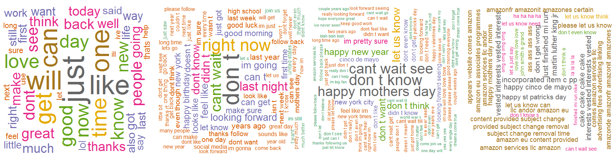

---
title       : Project PredictORama
subtitle    : Coursera Data Science Specialization
author      : Eric VACHON
job         : January 2016
logo        : logo.jpg
framework   : io2012   # {io2012, html5slides, shower, dzslides, deckjs...}
widgets     : [bootstrap,quiz]   # {mathjax, quiz, bootstrap}
mode        : selfcontained # {standalone, draft}
knit        : slidify::knit2slides
--- 
<!--
library(slidify)
setwd("D:\\_GIT_\\Capston_Project")
publish(title = 'Project PredictORama', 'slides.html', host = 'rpubs') 

in libraries/frameworks/io2012/css/default.css

aside.gdbar {
  height: 200px;
  width: 410px;

aside.gdbar img {
  width: 390px;
  height: 180px;
-->

## PredictORama
 
The aim of this project is to use three datasets from SwiftKey to create a algorithm to predict the next word of a sentence. 

To realize this, we create two clean data sets of [1-gram, 2-gram, 3-gram and 4-gram] (https://en.wikipedia.org/wiki/N-gram) : one with [stop words] (https://en.wikipedia.org/wiki/Stop_words) and another without.

  

--- .class #id 

## Algorithm and prediction 

1. Load and clean data  
  a. transform data to lower case  
  b. remove punctuation  
  c. remove numbers  
  d. remove or not stop words  
  e. remove multiple whitespace  
NB: a n-gram is a (n-1)-gram + 1-gram.   

2. Prediction  
  a. take the 3th last words of the sequence ans search if this 3-gram can be found as 3-gram start of a 4-gram in the 4-gram corpus to infer the last word.  
  b. if we found 4-gram started by this 3-gram we add to the result the top frequency words  
  c. if not do find in the quadrigram corpus we do the sam with the 2 last words of the sentence and we look in the trigram corpus ...  
  d. and we repeat this in the bigram corpus if not found.  
  
At the end we present the 7th top frequency words.

--- .class #id  

## shiny app

To optimize the memory of the the shiny app, we reduce the n-gram array :
- we take only the 1-gram with minimum 2 occurences
- we take only the 2-gram with minimum 4 occurences
- we take only the 3-gram with minimum 5 occurences
- we take only the 4-gram with minimum 5 occurences
  
  

--- .class #id  

## Why this is great :-)
We optimize the time of gramization by using the partallelisationwith R (library parallel, foreach, doParallel), but this parallelisation can be greater with a hadoop cluster :-)  
one interesting thing is to compare clean data with and without stop words.  

The are a lot's of perspectives with this study,for example :
- using more algorithms tyo predict (good turing, smoothiong,...) 
- learn and save from user sentence  
- ...
- and many more ...

My URL :  
[The Shiny App](https://ervachon.shinyapps.io/Capston_Project)  
[My Github](https://github.com/ervachon/Capston_Project)  
[Coursera Milestone Report](http://rpubs.com/ervachon/139299)

