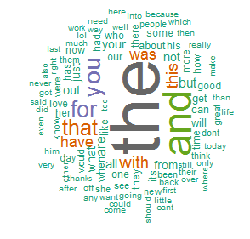
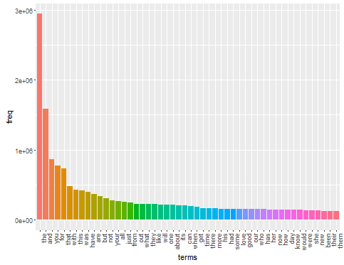
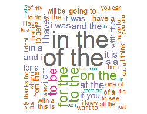
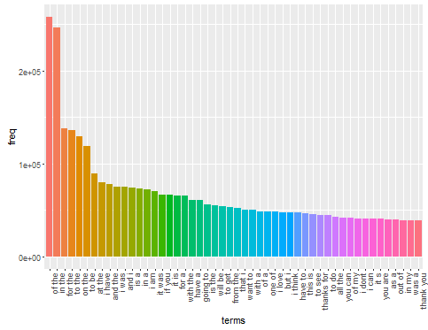
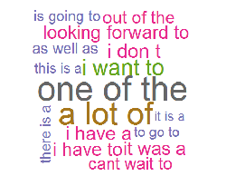
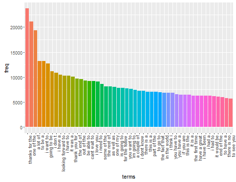
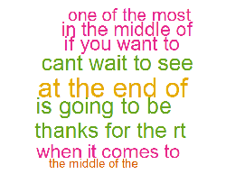
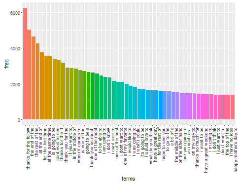

---
title: "Coursera Capston Project"
author: "Eric VACHON"
date: "December 2015"
output: html_document
--- 
<!--
https://support.rstudio.com/hc/en-us/articles/205002917-SSL-certificate-problem-when-publishing-to-RPubs
file.edit('~/.Rprofile') **<--options(rpubs.upload.method = "internal")**
library(slidify)
setwd("D:\\_MOOC_\\git\\Capston_Project")
publish(title = 'Coursera Capston Project', 'index.html', host = 'rpubs') 
setwd('D:\\_MOOC_\\git\\Capston_Project')
-->


## Aim of the capston project.
The aim of this project is to use 3 datasets from [SwiftKey](https://d396qusza40orc.cloudfront.net/dsscapstone/dataset/Coursera-SwiftKey.zip)  to create a algorithm to predict the next word of a sentence.  
  
  
For exemple, if we give to the algorithm : "i love" may be if we train the algorithm with love letters, it will give us for exemple the next word : "you".

## Download and load the data source.
First step : load ands summary the raw data :  

 lines  |   words  | char/bytes| filename          
--------|----------|-----------|-------------------    
 899288 | 37334114 | 210160014 | en_US.blogs.txt   
1010242 | 34365936 | 205811889 | en_US.news.txt    
2360148 | 30359852 | 167105338 | en_US.twitter.txt   

the 5 first line of en_US.twitter.txt 
```{r, message=FALSE, warning=FALSE,echo = FALSE }
t <- file("head.twitter.txt")
open(t)
while (length(line <- readLines(t, n = 1, warn = FALSE)) > 0) {
   print (line)
} 
close(t) 
```

## Clean data.

The second step of the projetc is to clean the raw data :

* we remove all non standard character
* we change the case of all the text : in lower case  
* we remove the punctuation.
* we remove the umbers.
* we transform al multiple space into one.
  
NB: in this first approach we don't choose (for the moment) to remove stop words or transform phonetic world (for example transform "4"" into "for").  

## Algorithm.

In this study we use n-gram / backoff model to predict next word :

A (n-gram)[https://en.wikipedia.org/wiki/N-gram] is a contiguous sequence of n words. For exemple "i love you" is a 3-gram (trigram).  

1. We search if the 3 last words (3-gram) of the sentence can predict the next word, we saerch in the 4-gram corpus quadrigram that start by the 3 words. If we find quadrigram we show the top 3.  
2. if not do find in the quadrigram corpus we do the sam with the 2 last words of the sentence and we look in the trigram corpus ...  
3. we repeat this in the bigram corpus.   
... 

At the end if we didnt find a ngram we take the top 1 of the unigram corpus.

Here it is a summary (wordcloud and distribution) of the n-gramization of our corpus:  
* unigram (1-gram) : 737 895 unigrams  
 
 

* bigram (2-gram) : 10 447 425  bigrams  
 
 

* trigram (3-gram) : 31 477 015 trigrams  
 
 

* quadrigram (4-gram) : 47 183 410 quadrigrams  
 
 

<!--
library(wordcloud)
pal = brewer.pal(9,"BuPu")
wordcloud(words = wF$terms,
          freq = wF$freq,
          scale=c(5,0.5), 
          max.words=50, 
          random.order=FALSE, 
          rot.per=0.35, 
          use.r.layout=FALSE, 
          colors=brewer.pal(8,"Dark2"))

load('D:\\_MOOC_\\git\\Capston_Project\\data\\w3.RData'))
a<- wF[1:50,]
rownames(a) <- 1:nrow(a)
a$terms <- factor(a$terms, levels = a$terms[order(a$freq,decreasing=T)])
ggplot(a, aes(x=terms,y= freq)) +
   geom_bar(stat = "identity", aes(fill = terms)) +
   theme(legend.position="none",axis.text.x = element_text(angle = 90, hjust = 1))
-->


## Shiny app. 
One problem with shiny app is that we can't upload the complet n-gram dump (850 Mb) :  
* w1.RData :   6105317 bytes  
* w2.RData :  88791313 bytes  
* w3.RData : 292599384 bytes  
* w4.RData : 502267055 bytes  

So we must reduce the n-gram corpus : we are going to select only the more representative ngrams of each corpus :  

Optimization : reduce the corpus of ngram  
  a. unigram : minimum 50 occurences  
  b. bigram : minimum  10  occurences  
  c. trigram :minimum  5 occurences  
  d. quadrigram : minimum 1 occurences  

NB: we are going to adjuste this numbers by analysing next week the complet distribution of each corpus.

## Futur improvements.
in our  first work we use backoff algorithm (find in 4gram, next 3gram....) but we want to use the MLE algorithm

a good survey of different algorithm can be found [here] (https://www.cs.cornell.edu/courses/CS4740/2012sp/lectures/smoothing+backoff-1-4pp.pdf)

another way is to remove stop words like the most common "the", "a", etc.  
Indeed if we look at the the distibution of the top 50 unigrams, most of them are stop words.  

The n-gramization is very memory cusumming so i use parralellisation to compute 1 to 4 gram (**library : parallel, foreach and doParallel**) by 200 000 lines pack. At the end : more than **7 hours spend** to  compute 100% of the sources and **one hour** to merge the complet sets.
We purpose to use a HADOOP Clus4ter (map-reduce) to speed up the n-gramization (it is a perpective).

Many optimlization can be done like :
* remove insanity words
* tranform phonetic words
* use a thesaurus (or word2vect) to find synonym
* ...  

## Links. 

- [My Shiny App will be here](https://ervachon.shinyapps.io/Capston_Project)  
- [My Github](https://github.com/ervachon/Capston_Project)  
- [Coursera link](https://class.coursera.org/dsscapstone-006)  

## Appendix.

Computer :  
- CPU : core i5  
- RAM : 16 Mb  
- OS : Windows 7  
- R : version 3.2.3 (2015-12-10)  
  
library used with R 64bit:  
- rJava, NLP, RWeka, tm  
- data.table  
- wordcloud  
- slam  
- parallel, foreach, doParallel  

