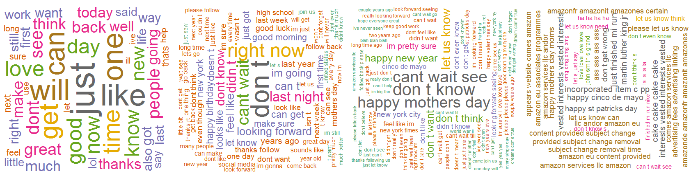

---
title       : Project PredictORama
subtitle    : Coursera Data Science Specialization
author      : Eric VACHON
job         : January 2016
logo        : logo.jpg
framework   : io2012   # {io2012, html5slides, shower, dzslides, deckjs...}
widgets     : [bootstrap,quiz]   # {mathjax, quiz, bootstrap}
mode        : selfcontained # {standalone, draft}
knit        : slidify::knit2slides
--- 

## PredictORama
 
The aim of this project is to use three datasets from SwiftKey to create a algorithm to predict the next word of a sentence. 

To realize this, we create two clean data sets of [1-gram, 2-gram, 3-gram and 4-gram] (https://en.wikipedia.org/wiki/N-gram) : one with [stop words] (https://en.wikipedia.org/wiki/Stop_words) and another without.

  

