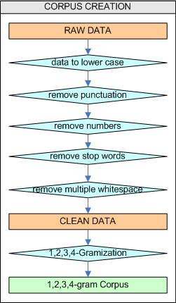

---
title       : Project PredictORama
subtitle    : Coursera Data Science Specialization
author      : Eric VACHON
job         : January 2016
logo        : logo.jpg
framework   : io2012   # {io2012, html5slides, shower, dzslides, deckjs...}
widgets     : [bootstrap]   # {mathjax, quiz, v}
mode        : selfcontained # {standalone, draft}
knit        : slidify::knit2slides
--- 

<!--
https://cran.r-project.org/bin/windows/Rtools/Rtools33.exe

library(devtools)
install_github('ramnathv/slidify', 'ramnathv')
install_github('ramnathv/slidifyLibraries', 'ramnathv')
-------------------------------------------------------------------------
library(slidify)
setwd("D:\\_GIT_\\Capston_Project")
slidify("slides.Rmd")
publish(title = 'Project PredictORama', 'slides.html', host = 'rpubs') 
-------------------------------------------------------------------------
in libraries/frameworks/io2012/css/default.css

aside.gdbar {
  height: 200px;
  width: 410px;

aside.gdbar img {
  width: 390px;
  height: 180px;
-------------------------------------------------------------------------
.Rprofile put options(rpubs.upload.method = "internal") 

-->

## PredictORama : Overview
 
The aim of this project is to use three datasets from  [SwiftKey](https://d396qusza40orc.cloudfront.net/dsscapstone/dataset/Coursera-SwiftKey.zip) to create a algorithm to predict the next word of a sentence. 

To realize this, we create two clean data sets of [1-gram, 2-gram, 3-gram and 4-gram] (https://en.wikipedia.org/wiki/N-gram) : one with [stop words] (https://en.wikipedia.org/wiki/Stop_words) and another without. The shiny app provide to compare results between this two data sets (with and without stop words).  

NB: a n-gram is a (n-1)-gram + 1-gram.   

  

--- .class #id 

##  PredictORama : Corpus creation  

  
NB: We optimize the time of gramization by using the partallelisation with R (library parallel, foreach, doParallel), but this parallelisation can be greater with a hadoop cluster 

--- .class #id  

## PredictORama : Prediction and optimization

### <u>How we predict :</u>
1. apply to the user sentence the same transformation as the corpus creation
2. take the 3 last words of the sentence
3. find this 3-gram as the 3 begining words on the 4-gram corpus
4. if find all 4-gram (max 7 res)and add them into result set
5. repeat 2. to 6 with 3-gram and 2-gram until 7 results find or all corpus analysed

### <u>Memory optimisation ???</u>
To optimize the memory of [The Shiny App](https://ervachon.shinyapps.io/Capston_Project), we reduce the n-gram corpus :  
1-gram with min 2 occurences  
2-gram with min 4 occurences  
3-gram with min 5 occurences  
4-gram with min 5 occurences.  

  

--- .class #id  

##  PredictORama : Perspectives

The are a lot's of perspectives with this study,for example :  
* using more algorithms to predict like linear interpolation, smoothing (good turing, ...) 
* learn from user sentences and save into corpus  
* use a hadoop cluster to spend less time to gramimzation (instead of using R parallelisation) 
* and many more ...
   

### My URL
[The Shiny App](https://ervachon.shinyapps.io/Capston_Project)  
[My Github](https://github.com/ervachon/Capston_Project)  
[Coursera Milestone Report](http://rpubs.com/ervachon/139299)
   

### Thanks to read my slides :-)

