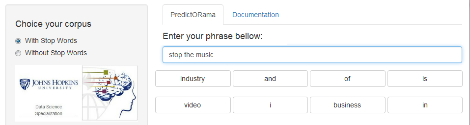

---
title       : Project PredictORama
subtitle    : Coursera Data Science Specialization
author      : Eric VACHON
job         : January 2016
logo        : logo.jpg
framework   : io2012   # {io2012, html5slides, shower, dzslides, deckjs...}
widgets     : [bootstrap]   # {mathjax, quiz, v}
mode        : selfcontained # {standalone, draft}
knit        : slidify::knit2slides
--- 

<!--
https://cran.r-project.org/bin/windows/Rtools/Rtools33.exe

library(devtools)
install_github('ramnathv/slidify', 'ramnathv')
install_github('ramnathv/slidifyLibraries', 'ramnathv')
-------------------------------------------------------------------------
options(rpubs.upload.method = "internal") 
library(slidify)
setwd("D:\\_GIT_\\Capston_Project")
slidify("slides.Rmd")
publish(title = 'Project PredictORama', 'slides.html', host = 'rpubs') 
This is the Capston project of the Coursera data scientist specialization done by Eric VACHON.
-------------------------------------------------------------------------
in libraries/frameworks/io2012/css/default.css

aside.gdbar {
  height: 200px;
  width: 410px;

aside.gdbar img {
  width: 390px;
  height: 180px;
-------------------------------------------------------------------------
.Rprofile put options(rpubs.upload.method = "internal") 

-->

## PredictORama : Overview
 
The aim of this project is to use three datasets from  [SwiftKey](https://d396qusza40orc.cloudfront.net/dsscapstone/dataset/Coursera-SwiftKey.zip) to create a algorithm to predict the next word of a sentence. 
For exemple, if we give to the algorithm : "i love" and if we train the algorithm with love letters, it may give us the next word : "you".

To realize this, we create two clean data sets of [1-gram, 2-gram, 3-gram and 4-gram] (https://en.wikipedia.org/wiki/N-gram) : one with [stop words] (https://en.wikipedia.org/wiki/Stop_words) and another without. [The Shiny App](https://ervachon.shinyapps.io/Capston_Project) provide to compare results between this two data sets (with and without stop words).  

NB: a n-gram is a (n-1)-gram + 1-gram.   

  

--- .class #id 

##  PredictORama : Algorithm  
### <u>Corpus creation</u>
The first step of this work is to clean data :  
1. we change the case of the text to lower  
2. we remove punctuation, numbers, stopwords (or not)  and multiple whitespace.    
We optimize the time of gramization by using the R libraries [parallel](https://stat.ethz.ch/R-manual/R-devel/library/parallel/doc/parallel.pdf), [doParallel](https://cran.r-project.org/web/packages/doParallel/index.html) and [foreach](https://cran.r-project.org/web/packages/foreach/index.html).

### <u>Prediction</u>
1. apply to the user sentence the same transformation as the corpus creation,
2. take the 3 last words of the sentence,
3. find this 3-gram as the 3 begining words on the 4-gram corpus,
4. if find all 4-gram (max 7 res)and add them into result set,
5. repeat 2. to 6 with 3-gram and 2-gram until 7 results find or all corpus analysed.

--- .class #id 
##  PredictORama : Shiny app

First you choice on the sidebarPanel which corpus you want to use: with or without stop words. **WAIT** a few seconds until **"Wait CORPUS is loading"** is gone. Next write a sentence on the "sentence" box and wait until the eight buttons labels are update with the best predict words. Then you can click on a button to add the word at the end of your sentence. 

### <u>Memory optimisation</u>
To optimize the memory of [The Shiny App](https://ervachon.shinyapps.io/Capston_Project), we truncate the n-gram corpus, for example  we select only 3-gram with minimum 5 occurences.

--- .class #id  

##  PredictORama : Perspectives

The are a lot's of perspectives with this study, for example :  
* tryiong more predict algorithms like linear interpolation, smoothing (good turing, ...) 
* learn from user sentences and save into corpus  
* use more corpus to enhance our n-gram corpus  
* use a hadoop cluster to spend less time to gramization (instead of using R parallelisation)  
* use the complete n-gram corpus and not truncate one (cause of shiny memory optimization)
* and many more ...

### <u>My URL</u>
[The Shiny App](https://ervachon.shinyapps.io/Capston_Project)  
[My Github](https://github.com/ervachon/Capston_Project)  
[Coursera Milestone Report](http://rpubs.com/ervachon/139299)
   

### <u>Thanks to read my slides :-)</u>

